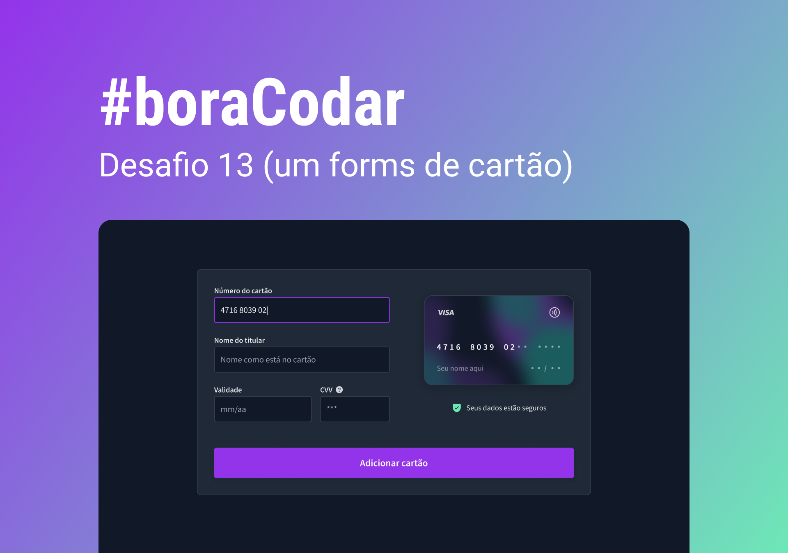

  

## 💻 Projeto

Desafio #BoraCodar#13.

## ✨ Tecnologia

- [TypeScript](https://www.typescriptlang.org/)
- [React](https://reactjs.org/)
- [Tailwindcss](https://tailwindcss.com/)
- [Nextjs](https://nextjs.org/)

## 🔖 Layout

Podes visualizar o layout do projeto através do link abaixo:

- [Layout](https://www.figma.com/file/h15cy8Pc1Nf0lreyexUUST/%23boraCodar---Desafio-13-(Community)?type=design&node-id=101-688&t=3dxtz2thKCdxZ32w-0)

Lembrando que precisas de ter uma conta no [Figma](http://figma.com/).

  Feito com 💜 by Rocketseat

